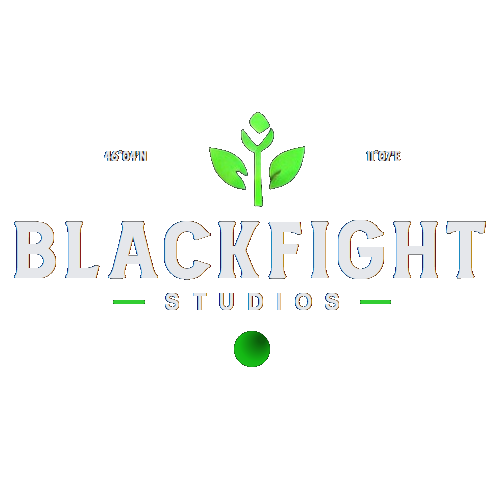

  

# Blackfight Studios - GitHub Academy

**Blackfight Academy** is an open-source initiative aimed at bringing together developers to contribute to humanitarian and NGO-related projects. We focus on creating digital tools, frameworks, and platforms that can make a real difference in the work of non-governmental organizations (NGOs) around the world. These projects are designed to address various humanitarian challenges, streamline operations, and support global efforts for a better tomorrow.

## Mission

Our mission is to leverage open-source development to improve the operational efficiency, transparency, and impact of NGOs. By working together, we can build the tools that organizations need to drive their initiatives forward. GitHub Academy encourages collaboration, knowledge-sharing, and empowerment of developers dedicated to creating social impact.

## Projects

We host a range of open-source projects designed to support NGOs and humanitarian efforts, focusing on the following areas:

- **Risk Assessment Platforms**: Tools to assess local risks and help NGOs plan for disaster response or crisis management.
- **Data Collection and Analysis Tools**: Platforms that enable NGOs to collect, process, and visualize data in real-time for more informed decision-making.
- **Resource Optimization Tools**: Systems that streamline logistics, resource distribution, and coordination across multiple organizations.
- **AI and Automation Solutions**: Developments in machine learning and AI to predict needs and optimize resource allocation.
- **Community Empowerment Solutions**: Platforms that give local communities the ability to collect their own data and collaborate with NGOs effectively.

Each project aims to empower NGOs, strengthen their ability to respond to crises, and improve their daily operations.

## How to Contribute

We welcome developers from all backgrounds to contribute to our projects. Whether you're a seasoned developer or a beginner looking to make a difference, there’s a place for you in Blackfight Academy.

### Ways to Get Involved:

- **Code**: Fix bugs, add new features, or improve existing tools.
- **Documentation**: Help by writing or improving documentation for our projects.
- **Translation**: Help us translate the platform into other languages to ensure accessibility for people worldwide.
- **Testing**: Test the projects, identify issues, and provide feedback.
- **Ideas**: If you have an idea for a new project or feature that could benefit NGOs, we’d love to hear it.

### Steps to Contribute:

1. Fork the repository of the project you want to contribute to.
2. Clone your fork to your local machine.
3. Create a new branch for your changes.
4. Make the changes and test thoroughly.
5. Submit a pull request with a description of your changes and why they are important.

## Current Projects

You can find a list of our active projects in the [Projects](https://github.com/orgs/Blackfight-Studios/repositories) repository.

## License

All projects hosted under GitHub Academy are licensed under the [GNU Public Version 3 License](https://opensource.org/license/gpl-3-0), unless otherwise stated.
